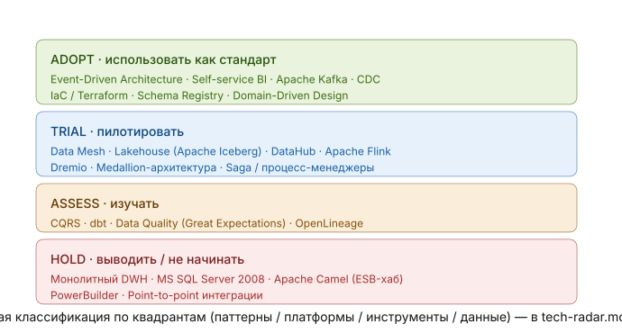

## Выполнение задания по спринту 11 "Построение архитектуры данных, технологические тренды и миграция в облака"

### Задание 1. Модульная инфраструктура для нескольких сред

Ключевая идея: модуль != корневая конфигурация
Модуль (modules/vm/) — это переиспользуемый «кирпич». В нём только параметризованные ресурсы и ноль конкретики окружений: ни провайдера, ни backend, ни захардкоженных id, зон, размеров. Он отвечает на вопрос «что мы создаём» - ВМ такой-то формы.
Корневая конфигурация окружения (envs/dev|stage|prod/) - это «вызыватель» модуля. Здесь настраивается провайдер и хранилище состояния (state), и сюда через .tfvars подставляются конкретные значения. Отвечает на вопрос «где и с какими параметрами».
Поэтому:
* Бизнес-логики окружений в модуле нет принципиально;
* Окружения изолированы по state/каталогам;
* В prod отключён публичный IP по соображениям безопасности;
* Для боевого использования local-backend меняется на удалённый (S3 в Object Storage) с отдельным ключом на окружение.

Выполнение задания описано в [README.md](Task1Advanced/README.md)

### Задание 2. Интеграция с CI/CD и удалённым хранением состояния

State вынесен в Object Storage с блокировкой и версионированием. Apply гейтится ручным аппрувом защищённого окружения и применяет именно отревьюенный план. Секреты в коде отсутствуют и при необходимости заменяются на OIDC без долговременных ключей.

Чтобы «кнопка approval» реально работала, в настройках репозитория (Settings → Environments) нужно создать окружения `dev`, `stage`, `prod` и для `prod` (и при желании `stage`) включить Required reviewers. Тогда job `apply` повиснет в ожидании ручного подтверждения — это и есть гейт. Без этой настройки сам YAML гейт не создаёт.

Сделано ради безопасности:
- Секреты (ключ SA, ключи доступа к Object Storage) живут в GitHub Secrets, в коде их нет; ключ SA передаётся через `env`, а не инлайнится прямо в строку `run` (так он не попадёт в трассировку команды).
- `permissions:` урезаны до минимума.
- `apply` отделён от `plan`, запускается только вручную и только после аппрува защищённого окружения.

Полное описание: [README.md](Task2Advanced/README.md)

### Задание 3. Проектирование целевой архитектуры и оценка рисков внедрения

DWH становится источником через CDC, событийная шина как ядро интеграции, Data Mesh поверх lakehouse, медицинские данные вне аналитического контура
Карта рисков и план снижения входят в поставку

Детальное описание: [README.md](Task3Advanced/README.md)

### Задание 4. Моделирование домена и интеграций

** Bounded contexts **
Система разбита на четыре домена и контексты внутри них:

* Медицинские домены: Клиники (пациенты, приёмы, медкарты), ИИ-диагностика (исследования, модели).
* Банковский домен: Счета и платежи, Кредитование.
* Корпоративный/общий домен: Клиенты и согласия (единый Party + согласия на обработку медданных), Биллинг, Общие сервисы (IAM, HR, склад), Отчётность/витрина.
* Будущие домены (подключаемые): Аптека/Фарма, Медэлектроника.

Все они интегрируются не напрямую, а через событийную шину как общий язык.

Пять артефактов по задаче: 

* [bounded-contexts.md](Task4Advanced/bounded-contexts.md) — карта контекстов
* [event-storming.md](Task4Advanced/event-storming.md) — событийная схема, три опорных потока в Mermaid и сводная карта «источник → подписчики».
* [aggregates.md](Task4Advanced/aggregates.md) — семь агрегатов с корнями, ключами, инвариантами и событиями.
* [events.md](Task4Advanced/events.md) — каталог событий с общим конвертом.
* [tech-radar.md](Task5Advanced/tech-radar.md) — обоснование по осям гибкость / масштабируемость / скорость с привязкой к целям и честными trade-offs (со ссылкой на меры из Task 3).

### Задание 5. Проектирование технологического стека и расчёт стоимости

#### Технологический радар

Три артефакта:

* [tech-radar.md](Task5Advanced/tech-radar.md) — расширенный радар по четырём квадрантам (паттерны, платформы, инструменты, данные) с кольцами Adopt/Trial/Assess/Hold и обоснованием каждого.
* [tco-analysis.md](Task5Advanced/tco-analysis.md) — модель TCO по четырём статьям, сравнение текущей и целевой архитектуры за 3 года, J-кривая с точкой окупаемости и качественные выгоды.
* [roadmap.md](Task5Advanced/roadmap.md)  — роли (Data Product Owner, Data Engineer, BI-аналитик и поддерживающие) и три этапа с критериями выхода и привязкой к бизнес-целям.