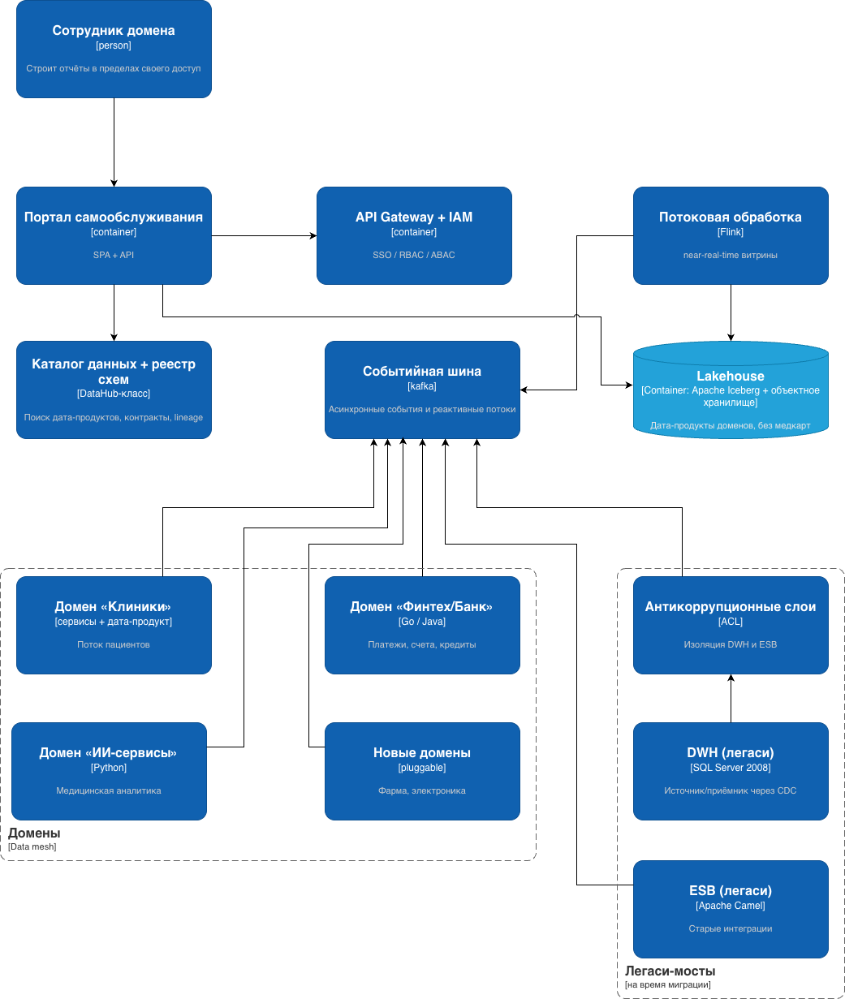
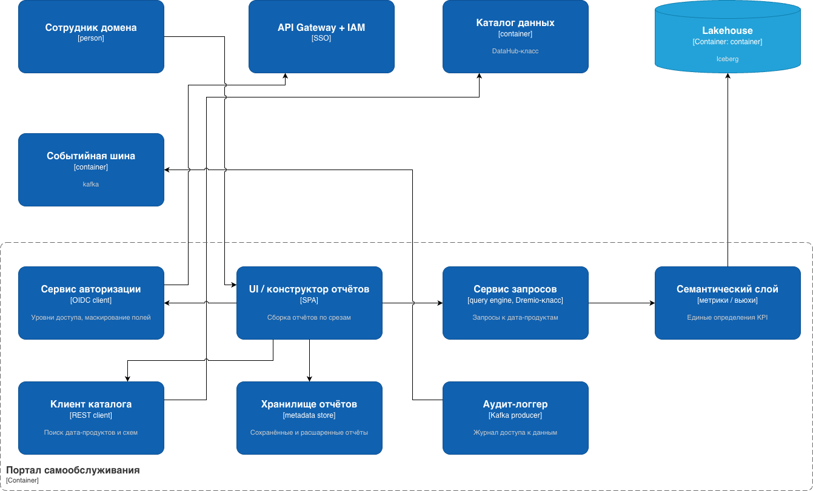

Задание 3 спринта 11: проектирование целевой архитектуры компании «Будущее 2.0» на горизонте трёх лет в нотации **C4** (уровни контейнеров и компонентов), **карта рисков** трансформации и **план управления** ими.

## Контекст

«Будущее 2.0» — выросший из медицинского стартапа холдинг: сеть клиник, компания ИИ-сервисов, купленный банк (финтех с банковской лицензией); на подходе фарма и производство медицинской электроники.

Текущее состояние — аналитический монолит:

- единый DWH на **Microsoft SQL Server 2008** (хранит клиентов, медкарты, истории болезней и исследования, финансы, счета, кредиты, HR, склад, отчётность — и бизнес-логику);
- интеграционный хаб (ESB) на **Apache Camel**;
- сильно кастомизированный **Power BI** и операторский UI на PowerBuilder.

Боль: сотни ТБ, огромное число сценариев и трансформаций, отчёты считаются часами, медленный time-to-market.

Что проектируем:

- масштабируемую **витрину самообслуживания** — пользователь строит отчёты в пределах своего уровня доступа; медкарты, истории болезней и результаты исследований **исключены** из аналитического контура;
- архитектуру для подключения новых направлений **без наращивания бизнес-логики в DWH**;
- переход за 3 года к **слабосвязанной событийной платформе** с near-real-time, мультирегиональностью (резидентность данных) и усиленной безопасностью медицинских и финансовых данных.

## Целевая архитектура «Будущее 2.0»

### C4 — Домены

### C4 — уровень компонентов: портал-витрина

## Целевая архитектура — ключевые решения

1. **DWH перестаёт быть «мозгом».** Бизнес-логика переезжает в доменные сервисы; DWH остаётся источником/приёмником и подключается через CDC.
2. **Событийная шина (Kafka) — ядро интеграции.** Домены общаются асинхронно через события и реактивные потоки; синхронные вызовы на критическом пути вытесняются поэтапно.
3. **Data Mesh поверх lakehouse (Apache Iceberg).** Домены владеют своими дата-продуктами; единый взгляд на KPI достигается через каталог и семантический слой, а не централизацию хранения.
4. **Портал самообслуживания** работает поверх дата-продуктов; медицинские данные физически вне аналитического контура, доступ ограничен ABAC/RBAC и маскированием полей.
5. **Безопасность и регуляторика — сквозной слой:** RBAC/ABAC, шифрование, маскирование и токенизация PII, изоляция сред (dev/stage/prod), резидентность данных по регионам.
6. **Вывод легаси по схеме Strangler Fig:** антикоррупционные слои (ACL) вокруг Camel и DWH как временные мосты совместимости.
7. **Эволюция batch → near-real-time** через потоковую обработку; реестр схем и очереди DLQ — фундамент надёжной событийности.

## Этапы перехода

| Этап | Срок      | Содержание                                                                            |
|------|-----------|---------------------------------------------------------------------------------------|
| 1    | 0–6 мес   | Пилот в 1–2 доменах: события, DLQ, каталог схем. DWH и Camel работают как есть.       |
| 2    | 6–18 мес  | Критичные домены переводятся на события; потоковые витрины; ACL вокруг Camel и DWH.   |
| 3    | 18–36 мес | Отказ от синхронных точечных интеграций; доменная аналитика на потоках; вывод легаси. |

## Карта рисков

Риски по трём категориям, с вероятностью и влиянием на бизнес:

| ID | Категория       | Риск                                                                                            | Вероятность | Влияние |
|----|-----------------|-------------------------------------------------------------------------------------------------|-------------|---------|
| A1 | Архитектурный   | Распределённый монолит: домены связаны синхронно/общими схемами, слабой связанности не получаем | средняя     | высокое |
| A2 | Архитектурный   | Нет единого взгляда на KPI при децентрализации → противоречивые отчёты                          | средняя     | высокое |
| A3 | Архитектурный   | Сложность событийности: дубли, потеря порядка, нет идемпотентности, разрастание схем            | высокая     | среднее |
| A4 | Архитектурный   | ACL/мосты становятся постоянными, легаси так и не выводится                                     | высокая     | среднее |
| O1 | Организационный | Незрелость доменных команд для владения дата-продуктами                                         | высокая     | высокое |
| O2 | Организационный | Сопротивление изменениям + зависимость от экспертов легаси (PowerBuilder, SQL 2008)             | средняя     | среднее |
| O3 | Организационный | Размытая ответственность за федеративное управление → стандарты не соблюдаются                  | средняя     | высокое |
| O4 | Организационный | Нехватка компетенций (Kafka, Flink, lakehouse, облако) → срыв сроков                            | высокая     | высокое |
| T1 | Технологический | Утечка/некорректный доступ к мед. и фин. данным, нарушение регуляторики и резидентности         | средняя     | высокое |
| T2 | Технологический | Vendor lock-in облака и managed-сервисов                                                        | средняя     | среднее |
| T3 | Технологический | Деградация near-real-time при росте источников и событий                                        | средняя     | среднее |
| T4 | Технологический | Миграция с SQL Server 2008: несовместимости, потеря данных                                      | средняя     | высокое |
| T5 | Технологический | Неконтролируемый рост облачных затрат                                                           | высокая     | среднее |

##  План управления рисками

Меры делятся на две группы. Технические - то, что закрывается архитектурой и инструментами; управленческие — то, что закрывается людьми, ролями и процессами. В скобках — какие риски из карты мера снижает.

### Технические меры:

* Контрактное взаимодействие через реестр схем (Schema Registry) с версионированием и обратной совместимостью. Это и есть лекарство от распределённого монолита: домены связаны явными контрактами, а не общими таблицами (A1, A3).
* Надёжность событий: идемпотентные потребители, ключи партиционирования для сохранения порядка, очереди DLQ для «битых» сообщений, паттерн outbox для гарантированной публикации (A3).
* Семантический слой и единый словарь метрик в каталоге — одно определение каждого KPI на все домены (A2).
* Защита данных: ABAC/RBAC, шифрование at-rest и in-transit, маскирование и токенизация PII, изоляция сред (твои dev/stage/prod из Task1–2), резидентность данных по регионам через раздельные регионы и бакеты (T1).
* Вывод легаси по Strangler Fig: ACL вокруг DWH и Camel, CDC для постепенного вытягивания данных вместо разовой «большой миграции» (A4, T4).
* Безопасная миграция с SQL Server 2008: автотесты миграции и параллельный (shadow) прогон старого и нового контуров со сверкой результатов перед переключением (T4).
* Устойчивость платформы: IaC (Task1–2), мультизональность, регулярные бэкапы и отрепетированные DR-процедуры.
* FinOps: бюджеты и алерты по затратам, автоскейл, теги и чарджбэк по доменам, гашение непрод-сред вне рабочего времени (T5).
* Анти-лок-ин: открытые форматы и протоколы (Iceberg, Kafka, открытые API), облачные сервисы за абстрагирующими интерфейсами (T2).
* Наблюдаемость: мониторинг lineage и нагрузки, горизонтально масштабируемая потоковая обработка с механизмами backpressure (T3).

### Управленческие меры:

* Программа зрелости доменных команд: вводятся роли data product owner, обучение, шаблоны дата-продуктов и «definition of done» для данных (O1).
* Орган федеративного управления (governance guild) из представителей доменов и платформенной команды; стандарты закрепляются как policy-as-code, а не как пожелания (O3, частично A1).
* Платформенная команда и «золотые пути» — готовые шаблоны и self-service-инструменты, снижающие порог входа для доменов (O1, O4).
* Компетенции: найм и обучение по Kafka/Flink/lakehouse/облаку, привлечение внешней экспертизы, обязательный пилот перед масштабированием (O4).
* Управление изменениями: вовлечение пользователей, поэтапность, удержание экспертов по легаси (PowerBuilder, SQL 2008) на переходный период, документация знаний (O2, частично A4).
* Поэтапный roadmap с измеримыми метриками — ровно три этапа из ТЗ, старт с пилота в 1–2 доменах. Раннее обучение на малом масштабе системно снижает почти все риски сразу.
* Регуляторный комплаенс: ответственный офицер, регулярные аудиты, DPIA для медицинских и финансовых данных, юридическая проверка при выходе в каждый новый регион (T1, организационная половина).

