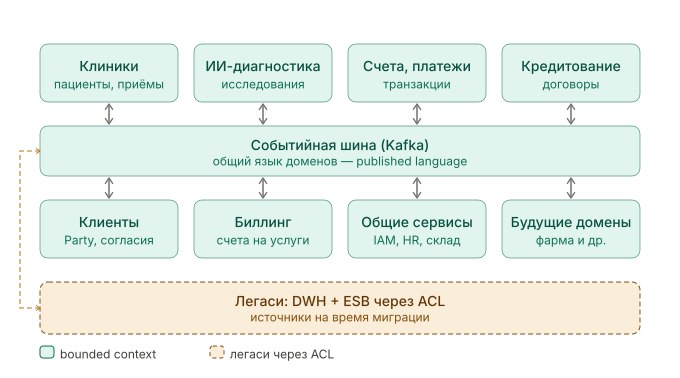

# Bounded Contexts — «Будущее 2.0»

Карта ограниченных контекстов: система разбита на четыре домена; контексты интегрируются через событийную шину как **published language** (общий контракт событий). Легаси подключается только через антикоррупционный слой.

## Домены и контексты

| Домен               | Bounded context                       | Зона ответственности                                  |
|---------------------|---------------------------------------|-------------------------------------------------------|
| Медицинские         | Клиники (Patient & Encounters)        | Регистрация пациентов, приёмы, медкарты (приватны)    |
| Медицинские         | ИИ-диагностика (AI Diagnostics)       | Исследования/анализы на медданных, модели, результаты |
| Банковский          | Счета и платежи (Accounts & Payments) | Счета, транзакции, платежи                            |
| Банковский          | Кредитование (Lending)                | Заявки, скоринг, кредитные договоры                   |
| Корпоративный/общий | Клиенты и согласия (Party & Consent)  | Единый `PartyId`, согласия на обработку медданных     |
| Корпоративный/общий | Биллинг (Billing)                     | Счета на услуги, тарификация                          |
| Корпоративный/общий | Общие сервисы (IAM, HR, Склад)        | Идентификация, персонал, снабжение                    |
| Корпоративный/общий | Отчётность / Витрина (BI)             | Self-service-аналитика поверх дата-продуктов          |
| Будущие (pluggable) | Аптека / Фарма                        | Рецепты, выдача, фарм-склад                           |
| Будущие (pluggable) | Медэлектроника                        | Производство устройств, BOM                           |

## Карта контекстов

## Отношения между контекстами (context mapping)

- **Published language** — событийная шина: все контексты обмениваются фактами в едином версионируемом формате событий, не зная о внутренних моделях друг друга.
- **Shared kernel** — `PartyId` из контекста «Клиенты и согласия»: общий идентификатор человека/организации, на который ссылаются и Клиники (`Patient`), и Банк (`Account`), сохраняя при этом независимые модели.
- **Customer / Supplier** — Биллинг (downstream) зависит от событий Клиник и Счетов (upstream); Витрина — downstream-потребитель событий всех доменов.
- **Anti-corruption layer (ACL)** — обёртка вокруг легаси DWH и ESB: переводит старые форматы в события целевого контракта, изолируя новые контексты от схемы SQL Server 2008.
- **Open Host Service** — каждый домен публикует стабильный набор событий как открытый интерфейс для подписчиков.

Принцип: контексты связаны только через события и `PartyId`. Подписчик не знает источник, источник не знает подписчиков — поэтому новый домен подключается без изменений в существующих.
