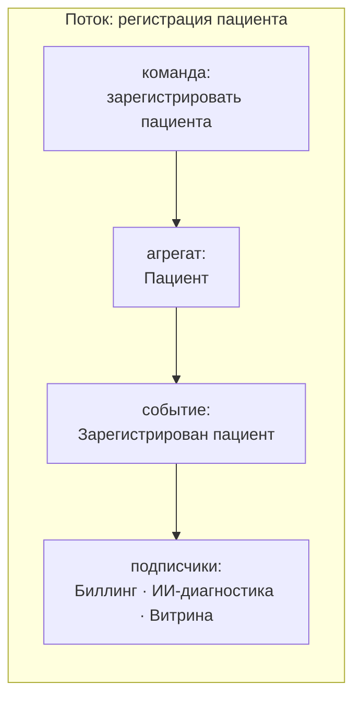
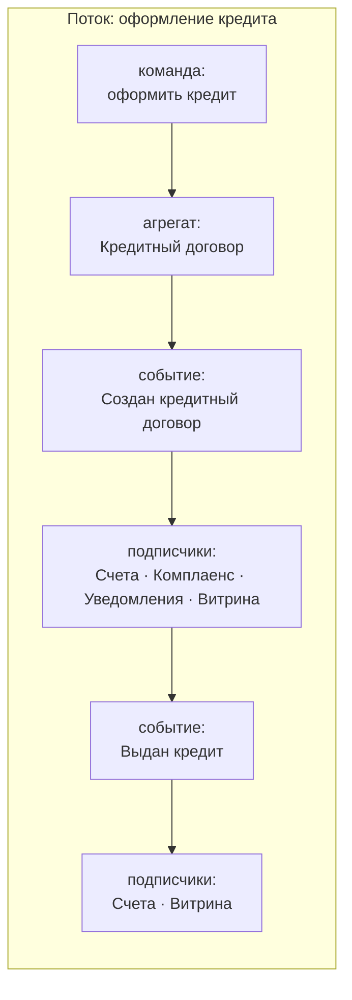
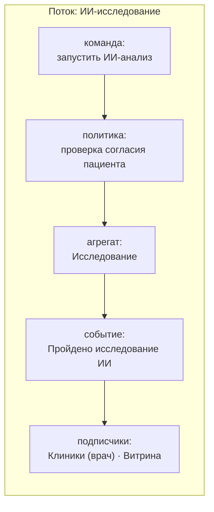

# Event Storming — «Будущее 2.0»

Событийная схема целевой архитектуры. Используется грамматика Event Storming:
**команда** (намерение) → **агрегат** (принимает решение, охраняет инварианты) → **доменное событие** (свершившийся факт) → **реакции/подписчики** (политики и другие контексты).

Цвета на сопровождающей диаграмме: коралловый — доменное событие, бирюзовый — контекст-источник/агрегат, серый — команды и подписчики.

## Опорные потоки (Mermaid)

## Сводная карта «источник → событие → подписчики»

| Контекст-источник | Доменное событие | Подписчики |
|-------------------|------------------|------------|
| Клиники | Зарегистрирован пациент | Биллинг, ИИ-диагностика, Витрина |
| Клиники | Завершён приём | Биллинг, Витрина |
| ИИ-диагностика | Пройдено исследование ИИ | Клиники, Витрина |
| Счета и платежи | Открыт счёт | Комплаенс, Витрина |
| Счета и платежи | Проведён платёж | Биллинг, Витрина |
| Кредитование | Создан кредитный договор | Счета, Комплаенс, Уведомления, Витрина |
| Кредитование | Выдан кредит | Счета, Витрина |
| Клиенты и согласия | Дано согласие на обработку | ИИ-диагностика, Клиники |

Полные контракты событий — в `events.md`.
